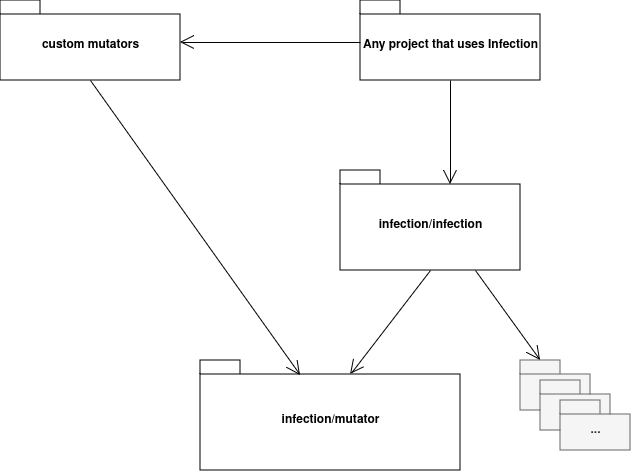

# Mutator interface for Infection

This is a repository for `Mutator` interface to implement custom mutators (mutation operators).



### Installation

```bash
composer require --dev infection/mutator
```

### Infection - Mutation Testing Framework

Please read documentation here: [infection.github.io](http://infection.github.io)

* Twitter: [@infection_php](http://twitter.com/infection_php)
* Mastodon: [@infection_php](https://mastodon.social/@infection_php)
* Discord: https://discord.gg/ZUmyHTJ
* [Playground](https://infection-php.dev/) - try it right in your browser!
